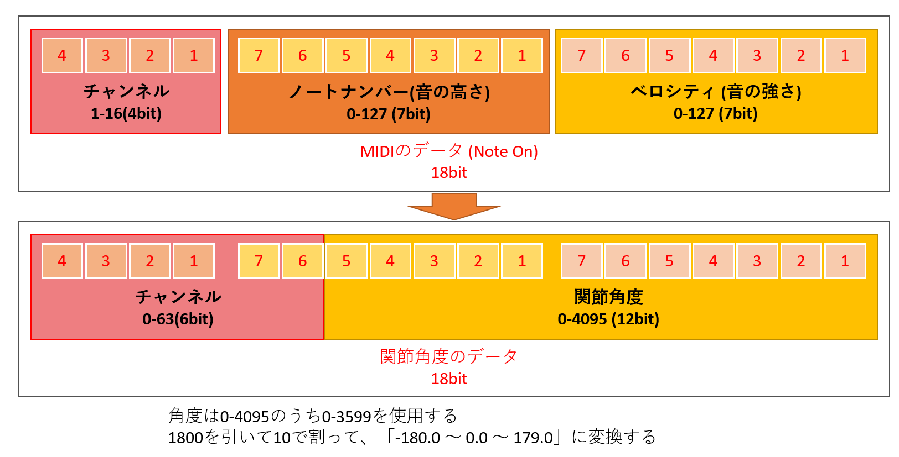

# Meridian_unity_demo_20220704 の VRChat同期改造版
ロボットを動かすと、VRChatワールド内のロボットが動作する、Unity UI側のリポジトリです。

# 概要

Meridianプロトコルで繋がったロボット(KHR-3)を動かすと、角度データがMIDIに変換され、VRChatワールド内の仮想のロボットが動作します。  
リアルのロボットと、VRChat内の仮想ロボットとのデジタルツインを実現しています。

https://github.com/Ninagawa123/Meridian_core/tree/main/Unity_demo  
オリジナルは、ニナガワさんのMeridianのUnity UIがベースになっており、こちらに「チェックボックスにチェックを入れるとVRChatに同期する機能」を足したものになります。

こちらのVRChatワールドで動作確認が出来ます。  
https://vrch.at/vqx9czsf

# 必要なもの

- Unity 2020.3.25f1
- 本リポジトリのUnityプロジェクト
- 本リポジトリ内のmidi-bridge-windows (再配布)
- loopMIDI : https://www.tobias-erichsen.de/software/loopmidi.html
- Meridian搭載のKHR-3とWiFi環境 (なくてもUnityプロジェクトからのデモは遊べます)

# 動作方法

まずは、loopMIDIをダウンロード＆インストールし、仮想のMIDIポートを一つだけ、作ります。  
仮想MIDIポートの名前は、なんでもOKです。その他、特に設定はありません。

midi-bridge-windows.zipを解凍し、MidiBridge.exeを起動します。  
初回起動時に、ファイアウォールを聞かれるので、ブロックしないでください。

Windowsの音量ミキサーを開き、MidiBridge.exeの音量をミュートしてください。  
通信に使うMIDIが音声として、再生されてしまうので、とってもウルサイです。

VRChatを起動して、ロボットデモのワールドに入ります。  
https://vrch.at/vqx9czsf

Unityプロジェクトを起動し、Sync VRChatのチェックを有効にします。

あとは、Meridianのいつもの使い方です！(雑)

# 注意点

MIDIを再生しながら、VRChatのワールドを移動すると、VRChatが落ちることがあります。  
ワールド移動の際、ロボットの同期が不要な時は、Sync VRChatのチェックは外すことをお勧めします。

# MIDIのデータ

ロボットの角度データをMIDIでどう扱っているのか、すべては下記の図の通りです。  
角度データからMIDI、MIDIから角度データ、それぞれ相互に変換して利用しています。

# 使用させていただいたアセット／連携ソフトウェア等

- https://github.com/keijiro/unity-midi-bridge
- https://github.com/keijiro/midi-bridge-windows
- https://www.tobias-erichsen.de/software/loopmidi.html

# 連絡先

みっちー / Twitter @Dream_Drive